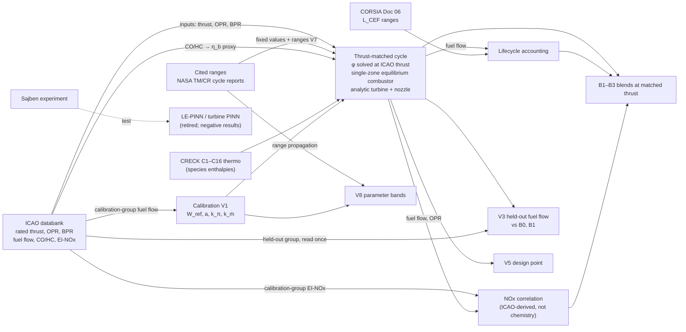

# Model map — claim to evidence (P6.7; answers R1.12, R1.14)

Generated by `scripts/build_manifest.py` from the same registry as `outputs/ARTIFACT_MANIFEST.md` — **do not edit by hand**.

| Row | Reported quantity | Computed by | Depends on | Constrained by data |
|---|---|---|---|---|
| V1 | v5 calibration (thrust-matched; amendment A2 selection `pilot_start_polish`) | `integrated_engine.run_at_thrust` (compressor, single-zone HP-equilibrium combustor, analytic turbine and nozzle) via `scripts/optimization/lto_v5.py` | ICAO rated thrust, OPR, BPR per record; x·F_rated per mode; fixed values with cited ranges (V7) | ICAO fuel flow of the calibration group (31 records, 9 groups) |
| V2 | Identifiability (profile likelihood, registered rule) | profile likelihood over the V1 objective | V1 objective | calibration-group fuel flow |
| V3 | Held-out fuel flow (87 rows, 9 held-out groups, 0 unreachable), group-weighted MAPE model  | `integrated_engine.run_at_thrust` (compressor, single-zone HP-equilibrium combustor, analytic turbine and nozzle) via `scripts/optimization/lto_v5.py`; baselines B0, B1 from calibration data | ICAO rated thrust, OPR, BPR per record; x·F_rated per mode; V1 parameters | ICAO fuel flow of the held-out group (29 records, 9 groups), read once |
| V4 | Finding F-A | v4 fixed-φ cycle (superseded) | rated-thrust ratio only | — |
| V5 | Take-off design point (AE3, matched 310.9 kN) | `integrated_engine.run_at_thrust` (compressor, single-zone HP-equilibrium combustor, analytic turbine and nozzle) via `scripts/optimization/lto_v5.py` | AE3 inputs; V1; fixed values with cited ranges (V7) | AE3 is a calibration engine (in-sample) |
| V6 | NOx correlation fitted on the calibration group only, scored on the held-out group (87 row | EI_NOx = A·OPR^B·ṁ_f^C (ICAO-derived correlation; not chemistry) | ICAO OPR, fuel flow | ICAO EI-NOx of the calibration group |
| V6b | Supplementary | same correlation | ICAO OPR, fuel flow | ICAO EI-NOx (leave-one-model-out) |
| V7 | Fixed parameters under the range rule | — | — | none — assumption, range cited (η_b: calibration-group CO/HC) |
| V8 | P6.2 refit-conditioned range bands (64 draws, P5–P95; range propagation under assumed unif | V1 re-fit per draw + `integrated_engine.run_at_thrust` (compressor, single-zone HP-equilibrium combustor, analytic turbine and nozzle) via `scripts/optimization/lto_v5.py` | V7 ranges | calibration-group fuel flow (re-fit per draw) |
| B1 | SAF blends at **matched thrust** (AE3, all LTO modes; φ solved). Take-off fuel flow vs Jet | `integrated_engine.run_at_thrust` (compressor, single-zone HP-equilibrium combustor, analytic turbine and nozzle) via `scripts/optimization/lto_v5.py`; lifecycle = ṁ_f·Σ p_i·LHV_i·L_CEF_i | blend mass fractions; AE3 inputs; V1; V7; CORSIA draws | none for blend effects (no blend engine data); CORSIA Doc 06 ranges for lifecycle |
| B2 | Variance decomposition at matched take-off thrust (256 Sobol blends) | random-forest permutation importance over B1 design | B1 outputs | — |
| B3 | CORSIA rank stability (1000 common draws) | Pareto set over B1 design under common CORSIA draws | B1 outputs; CORSIA ranges | CORSIA Doc 06 |
| E1 | CORSIA L_CEF triangular ranges, every value cited to ICAO Doc 06 (Nov 2025) rows | lifecycle accounting | — | ICAO Doc 06 |
| E2 | EI-CO₂ = 3.664·w_C (3.100 kg/kg Jet-A1; Cantera cross-check 3.098) | stoichiometry | surrogate composition | — |
| E3 | NOx three-path comparison at v5 states | correlation / Zeldovich on CRECK equilibrium / HyChem-A2 kinetics (evidence path only) | V5 states | ICAO EI-NOx (AE3) |
| E4 | Heat-loss sensitivity at matched take-off thrust | `integrated_engine.run_at_thrust` (compressor, single-zone HP-equilibrium combustor, analytic turbine and nozzle) via `scripts/optimization/lto_v5.py` | ξ ∈ {0, 2, 4, 6} % | none — structural argument for ξ = 0 |
| E5 | PINN component ablation (±10 % thrust; basis of the P3.1 adjudication). v3-state decision  | v3 fixed-φ cycle | — | — |
| E6 | Sajben negative result (wall-Cp shape-L2 0.71–1.09 vs < 0.10) | LE-PINN (retired) | Sajben geometry | Hseih et al. 1987 experiment |
| E7 | SAF-penalty ablation (removed penalties flipped the TSFC ranking; Phase 1) | v1 cycle | — | — |
| E8 | Parameter provenance table (supplementary material) | — | — | — |
| E9 | Mechanism/surrogate sensitivity (P6.4; AE3 take-off at matched thrust, v5 calibration held | `integrated_engine.run_at_thrust` (compressor, single-zone HP-equilibrium combustor, analytic turbine and nozzle) via `scripts/optimization/lto_v5.py` with CRECK / HyChem A1 / A2 thermo | V1; V7 | — |
| E10 | Surrogate LHVs computed from CRECK thermo (gas-phase fuel, H₂O vapour, 298.15 K) | CRECK species enthalpies | surrogate compositions | — |
| E11 | Turbine p5 adjudication (analytic = work-consistent; PINN −41.5 %); v3-state decision evid | analytic vs PINN turbine | — | — |
| P1 | Sajben P4.3 attempt 1 (ReLU, physics w 0.05 with warm-up) | PINN (retired) | — | see manifest |
| P2 | Sajben P4.3 attempt 2 | PINN (retired) | — | see manifest |
| P3 | Sajben P4.3 attempt 3 (tanh, μ from data), terminal | PINN (retired) | — | see manifest |
| P4 | Turbine surrogate attempt 1 | PINN (retired) | — | see manifest |
| P5 | Turbine surrogate attempt 2 | PINN (retired) | — | see manifest |
| P6 | Physics-residual defect | PINN (retired) | — | see manifest |
| P7 | P4.1 Sajben data audit | PINN (retired) | — | see manifest |
| P8 | Reimplementation audit against Ma et al. (AST 168, 111002) | PINN (retired) | — | see manifest |
